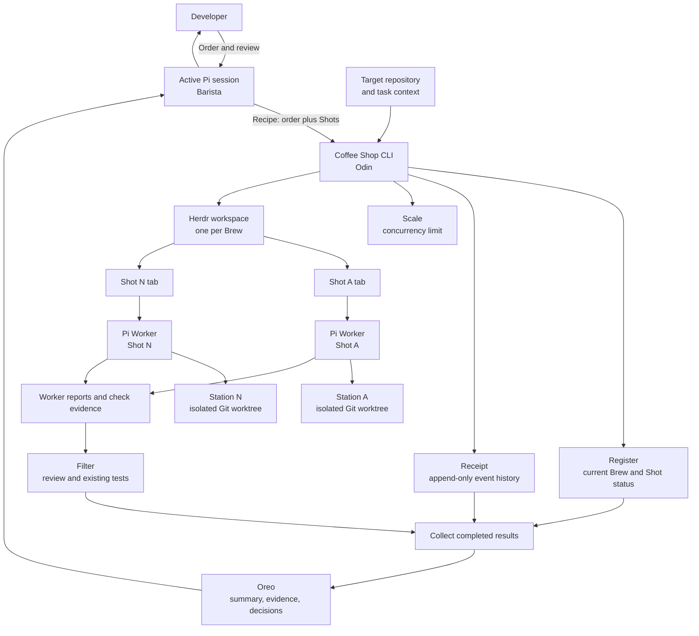

# Coffee Shop Architecture

Coffee Shop is a local Odin dispatcher. The active Pi session decides how to divide an Order. Coffee Shop starts and tracks Pi workers; it does not act as another AI coordinator.

## Architecture diagram

## Components

| Component | Responsibility |
| --- | --- |
| **Barista** | The active Pi session. It interprets an Order, writes a Recipe, and reviews results. |
| **Coffee Shop CLI** | The Odin program. It validates inputs, creates Stations, starts Workers in Herdr, records state, and collects results. |
| **Beans** | The target repository and task context supplied to workers. |
| **Recipe** | An Order and its explicit list of Shots. The Barista owns task decomposition. |
| **Shot** | One unit of work with one prompt and one Worker. |
| **Station** | A Git worktree isolated to one Shot. |
| **Worker** | One Pi CLI process in a Herdr tab, working in its Shot's Station. |
| **Register** | Durable current status for each Brew and Shot. |
| **Receipt** | Append-only events that explain status changes. |
| **Scale** | The maximum number of concurrent Workers. |
| **Filter** | Uses a separate one-shot Pi reviewer to check selected changes against the Beans repository's root `standards.md`, then discovers and runs unit/component and end-to-end test commands from existing manifests and test configuration. It reports evidence without fixing code or changing test setup. |
| **Oreo** | The final review packet with the outcome, evidence, and any decision for the developer. |

## Recipe contract

Recipes are strict JSON objects with a non-empty `order` and a non-empty `shots` array. Every Shot has a non-empty `prompt` and a unique `id` of 1–64 ASCII letters, digits, hyphens, or underscores; the first character must be a letter or digit. Prompts are preserved as supplied. This ID rule makes Shot names safe path segments and safe arguments to Coffee Shop's internal Worker command.

## Local state

Store each Brew under `$CS_STATE_DIR/<brew-id>/`; when `CS_STATE_DIR` is unset, the default is `~/.coffee-shop/<brew-id>/`. `CS_STATE_DIR` must be an absolute path. Coffee Shop does not use XDG or any other platform directory convention. A Brew ID is `brew-<UTC start time>-<pid>`, for example `brew-20261008T041500Z-1634886`, so sorting by name sorts by start time. IDs are never reused; a counter is appended if two Brews would collide. `register.json` contains its current state; `receipt.ndjson` is its append-only event history. This state remains outside the Beans repository.

The Receipt event is appended before the Register is rewritten. If a write is interrupted, or the two files disagree, Coffee Shop reports the Brew's state as unknown, names the failing line when it can, and leaves both files untouched. It never repairs state automatically. To recover, inspect `receipt.ndjson` and `register.json` by hand; the Receipt is the more detailed record. A file that cannot be read for another reason, such as permissions, is reported as an I/O error rather than as corruption.

## Shot lifecycle

| State | Meaning |
| --- | --- |
| `queued` | The Shot is validated and waiting to start. |
| `running` | Its Worker has started and no terminal outcome is confirmed. |
| `completed` | The Worker exited successfully. |
| `failed` | The Worker could not be launched or exited unsuccessfully. |
| `cancelled` | The Shot was cancelled before launch, or its Worker exited after a cancellation request. |
| `interrupted` | The Worker outcome cannot be proved, for example after an unexpected session loss. |

Allowed transitions are `queued` → `running`, `failed`, or `cancelled`, and `running` → `completed`, `failed`, `cancelled`, or `interrupted`. A cancellation request is recorded separately; a running Shot stays `running` until the Worker exit is confirmed, then becomes `cancelled`. Cancelling a Brew marks queued Shots `cancelled` and interrupts active Workers. Brew status is derived from its Shots rather than maintained as a second state machine.

## Cancellation and recovery

`cancel <brew-id>` records a cancellation request and is safe to repeat. While the supervisor is alive it does the work: queued Shots become `cancelled`, and each running Worker has its Herdr tab closed, which ends Pi. A Shot becomes `cancelled` once its Worker process is confirmed gone, or `interrupted` if that cannot be confirmed within ten seconds.

The supervisor records its process identity (PID plus kernel start time, so a reused PID is not mistaken for it) in `supervisor.json`; each Worker does the same in `workers/<shot>.started`. If the supervisor has died, `status` says so, and `collect` or `cancel` take over its job using only evidence: a Worker's result file is recorded as completed or failed, and a Worker that vanished without a result becomes `interrupted`. A live Worker is left alone unless the Brew is being cancelled. A Shot is never marked `completed` without a recorded successful result.

## Data flow

1. The Barista supplies a JSON Recipe and the path to the Beans.
2. The CLI validates the repository and Recipe before it starts Workers.
3. The CLI creates one Station per Shot and one Herdr workspace per Brew. A per-Brew supervisor creates one tab per Shot, runs `pi --print --no-session` from each Station, and keeps at most two Workers active. It schedules queued Shots as slots open and exits when the Brew is terminal.
4. Workers write their result and check evidence to their own Station. The Barista may assign a normal Shot to add tests from `standards.md`; that Worker receives the Taste-Driven Development skill as task guidance, without installing it into the Beans repository.
5. The CLI updates the Register and Receipt as it observes Worker state. The Scale allows two active Workers; the supervisor continues queued independent Shots after a Worker fails. There is no automatic timeout.
6. Filter runs a separate one-shot Pi code review against `standards.md`, then discovers and runs the repository's existing unit/component and end-to-end test commands without overriding them.
7. The Barista collects Worker reports and Filter evidence into the Oreo for human review.

## Safety boundaries

- A Worker never shares a Station with another Worker in the same Brew.
- Herdr launches Workers from command text. Its command contains only Coffee Shop's internal Worker subcommand, the state directory (so the Worker reads the same Brew state even when `CS_STATE_DIR` is set), and validated Brew/Shot IDs. That subcommand reads the prompt as data and starts Pi with a separate argument vector; Order and Shot text never enter shell syntax.
- Coffee Shop reports a missing or failed Worker as incomplete. It does not treat an unreadable state record as success.
- A test-authoring Worker reads the Beans repository's root `standards.md` and receives Taste-Driven Development as task guidance; Coffee Shop does not install the skill into the Beans repository.
- Filter reports review findings and test outcomes; it does not auto-fix, commit, merge, publish, or manage CI. It does not rewrite test scripts or configuration. If discovery is ambiguous or setup is unavailable, it reports that instead of guessing.
- Workers do not merge or publish their changes. A person reviews the Oreo and decides what to integrate.
- Coffee Shop never automatically deletes Stations or local Brew state. Users remove reviewed Stations and state manually; `collect` preserves them.
- The per-Brew supervisor exists only while `brew` is active; there is no always-on watcher or automatic Worker timeout. The Barista asks for status or collection when needed.
- The Register and Receipt live under the Coffee Shop state directory, outside the Beans repository.

## Deliberate omissions

The first version targets one machine, Pi, and Herdr. It does not include second mates, remote execution, Relay, tmux or zmx backends, automatic task decomposition, or automatic merges. Add a feature only when a real workflow needs it.
