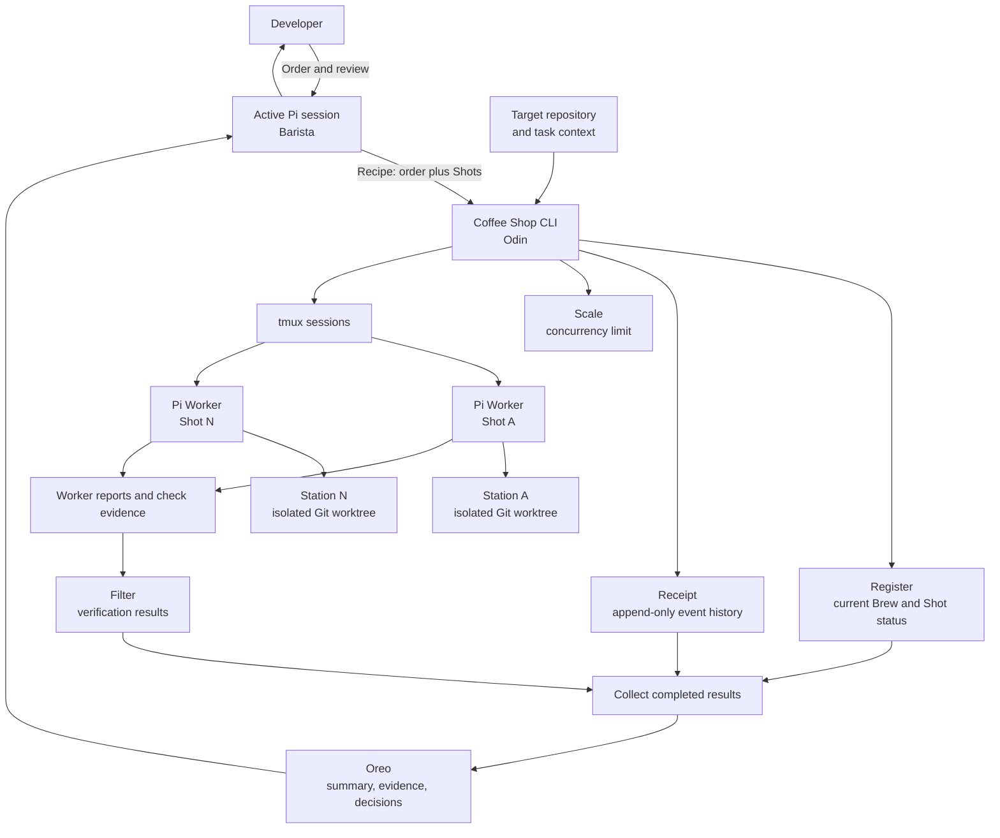

# Coffee Shop Architecture

Coffee Shop is a local Odin dispatcher. The active Pi session decides how to divide an Order. Coffee Shop starts and tracks Pi workers; it does not act as another AI coordinator.

## Architecture diagram

## Components

| Component | Responsibility |
| --- | --- |
| **Barista** | The active Pi session. It interprets an Order, writes a Recipe, and reviews results. |
| **Coffee Shop CLI** | The Odin program. It validates inputs, creates Stations, starts Workers, records state, and collects results. |
| **Beans** | The target repository and task context supplied to workers. |
| **Recipe** | An Order and its explicit list of Shots. The Barista owns task decomposition. |
| **Shot** | One unit of work with one prompt and one Worker. |
| **Station** | A Git worktree isolated to one Shot. |
| **Worker** | One Pi CLI process in a tmux session. |
| **Register** | Durable current status for each Brew and Shot. |
| **Receipt** | Append-only events that explain status changes. |
| **Scale** | The maximum number of concurrent Workers. |
| **Filter** | The verification evidence returned by Workers or requested checks. It reports results; it does not hide failures. |
| **Oreo** | The final review packet with the outcome, evidence, and any decision for the developer. |

## Data flow

1. The Barista supplies a Recipe and the path to the Beans.
2. The CLI validates the repository and Recipe before it starts workers.
3. The CLI creates one Station per Shot and starts each Pi Worker in tmux.
4. Workers write their result and check evidence to their own Station.
5. The CLI updates the Register and Receipt as it observes worker state.
6. The Barista collects completed results and prepares the Oreo for human review.

## Safety boundaries

- A Worker never shares a Station with another Worker in the same Brew.
- The CLI passes the Pi executable and arguments as separate process arguments. It does not build shell commands from task text.
- Coffee Shop reports a missing or failed Worker as incomplete. It does not treat an unreadable state record as success.
- Workers do not merge or publish their changes. A person reviews the Oreo and decides what to integrate.
- There is no always-on watcher. The Barista starts an explicit Brew and asks for status or collection when needed.

## Deliberate omissions

The first version targets one machine, Pi, and tmux. It does not include second mates, remote execution, Relay, multiple backends, automatic task decomposition, or automatic merges. Add a feature only when a real workflow needs it.
