# Oreo Architecture

Oreo is a small, standalone Odin agent harness. It starts as its own package in this repository, exposes a library API for Coffee Shop, and should be extractable into an independent repository.

Pi is a behavioral reference only. Oreo independently implements its auth, agent loop, and tools in Odin; it has no Pi code, runtime, executable, credential-store, or plugin dependency.

Oreo calls provider-owned endpoints directly and does not host a public OAuth service. Pi reference sources are listed in [Oreo's README](README.md#reference-implementation).

## System boundary

[PNG preview](assets/architecture-diagram.png) · [Open the self-contained HTML diagram](assets/architecture-diagram.html).

Each run call drives one session. Oreo imposes no limit on concurrent calls; the consumer supplies task context and owns scheduling and resource limits.

## Session configuration and accounts

- Keep work and personal subscription credentials side by side in Oreo's own credential store; logging into one must not overwrite the other.
- A session may override provider, model, and thinking level. For omitted values, use Oreo's default configuration; session overrides do not change those defaults.
- Credentials must support named accounts. The account selector/default-account behavior and default-config path/schema remain open implementation decisions.

## Responsibilities

| Oreo owns | Its consumer owns |
|---|---|
| Provider login and token refresh | How many sessions to start and when |
| One model session and its tool-call loop | Task decomposition and scheduling |
| The minimal `read`, `write`, and `execute` tools | Repository/worktree setup and cleanup |
| Oreo's own credential storage | Machine-wide CPU and memory policy |

Oreo does not create a worker pool or impose a global session limit. A consumer that starts many sessions is responsible for knowing the resource limits of its machine.

## Session flow

1. The consumer creates a session with a provider/model, instructions, and the available tools.
2. Oreo sends the conversation and tool definitions to that provider.
3. Oreo returns text to the consumer, or executes a requested tool and sends the result back to the model.
4. The loop ends when the model returns a final answer, the consumer cancels, or the provider reports an error.

A session belongs to its caller. The caller chooses its lifetime, runs concurrent sessions, and supplies the working directory and task context. Oreo does not decompose tasks or coordinate other sessions.

## Providers and authentication

Oreo independently implements the provider-specific flows in Odin, following Pi's flow behavior while calling provider-owned endpoints with client registration authorized for Oreo. Do not assume Pi's client IDs are reusable:

- **OpenAI Codex:** subscription OAuth with PKCE. Browser login uses a temporary callback listener bound to `127.0.0.1`; the user has approved a loopback redirect URI. Codex device-code login is the headless path, subject to provider support and Oreo's client registration.
- **GitHub Copilot:** subscription login through GitHub's device-code flow, followed by the Copilot token exchange.
- **Expiry:** refresh tokens when possible and provide a re-login path when refresh is rejected or credentials expire. The library's exact handoff to its caller remains to be specified.

These are provider-specific flows, not one generic OAuth implementation. Do not assume undocumented provider endpoints are reusable. There is no public Oreo OAuth endpoint. The loopback listener exists only during Codex browser login and closes when the flow ends.

Store credentials in Oreo's separate `~/.oreo/auth.json` with owner-only permissions. It must retain both work and personal accounts. Never log tokens or authorization headers. Reference source links are in [Oreo's README](README.md#reference-implementation).

### Authentication sequence

[PNG preview](assets/auth-flow.png) · [Open the self-contained HTML diagram](assets/auth-flow.html).

The sequence is a design sketch. Confirm Oreo's provider client registrations and endpoint support before implementation.

## Tools

Oreo starts with three tools:

| Tool | Responsibility |
|---|---|
| `read` | Read a file from the caller's working context. |
| `write` | Create or replace a file in that context. |
| `execute` | Run a requested command and return its result to the model. |

`execute` is Oreo's name for the command tool corresponding to Pi's `bash` tool; it does not imply a security sandbox. Unless the consumer supplies an operating-system boundary, tool actions have the permissions of the Oreo process. The three tools follow Pi's observable behavior and contracts, implemented independently; their exact schemas and output handling must be checked against the reference before coding.

## Package layout and boundaries

- Odin source belongs under `oreo/src/`; package-owned art and diagrams belong under `oreo/assets/`. The mascot is Oreo, the American Shorthair cat.
- Oreo is an Odin package/library first, not a wrapper around provider command-line processes.
- Provider clients and OAuth flows are implemented in Oreo.
- Coffee Shop may call Oreo as a library but retains responsibility for Workers, worktrees, state, and concurrency.
- No global resource manager, session scheduler, automatic task decomposition, or machine-wide OOM policy belongs in Oreo.
- No plugin system in the initial design. Add extension mechanisms only if a real consumer need justifies their API, lifecycle, loading, and security complexity.
- Additional tools or providers are added only when a consumer needs them.
