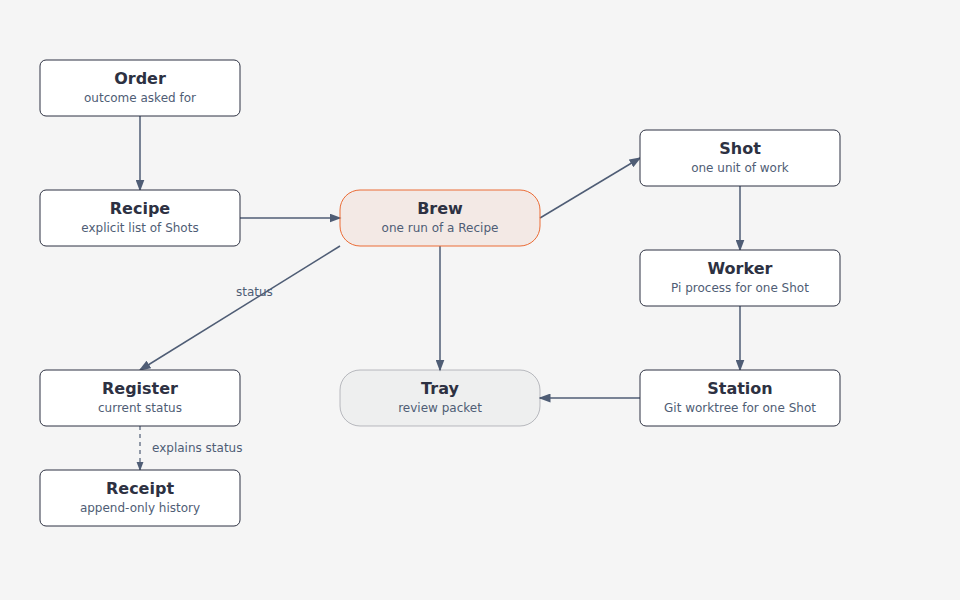
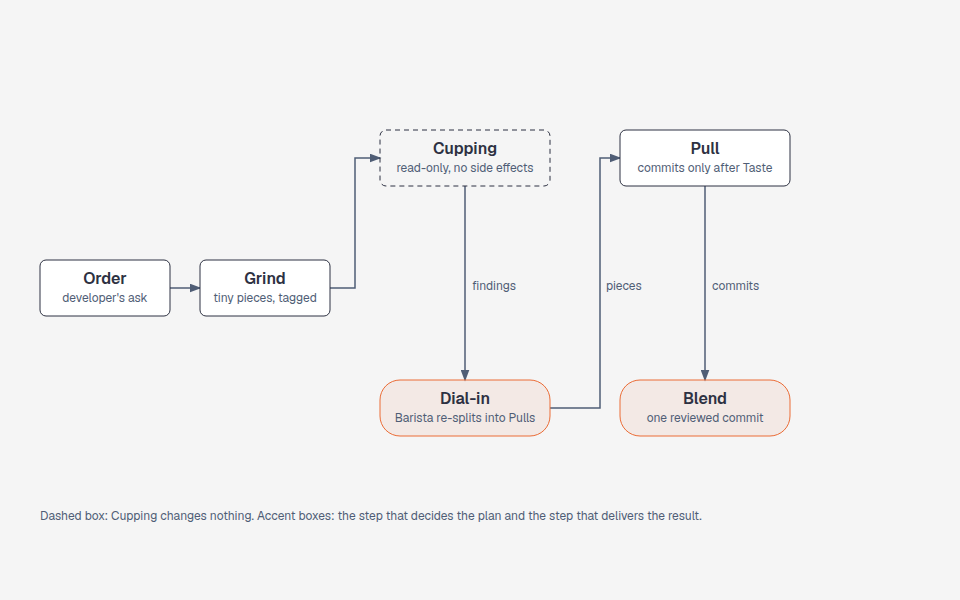
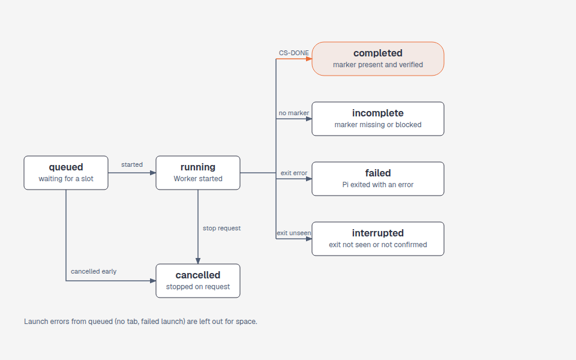
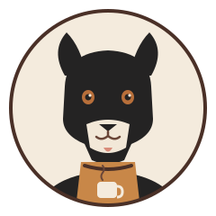
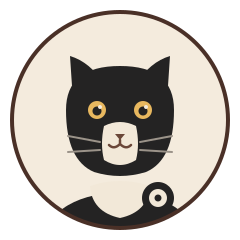

# Coffee Shop Vocabulary

Draft language for the small Pi-worker dispatcher. Coffee and snack metaphors name product concepts; technical terms such as **Pi process**, **Git worktree**, **status**, and **report** keep their ordinary meanings.

## Work

| Term | Definition | Aliases to avoid |
| --- | --- | --- |
| **Order** | The outcome a developer asks Coffee Shop to deliver. | Request, ticket (unless referring to an external issue) |
| **Recipe** | The explicit breakdown of an Order into independent units of work. | Plan, task list (use these only for their ordinary meanings outside Coffee Shop) |
| **Brew** | One execution of a Recipe, including dispatch, status tracking, and result collection. | Run, session (as names for the overall lifecycle) |
| **Shot** | One unit of work from a Recipe, assigned to one Pi worker. | Job, subtask, lane |
| **Barista** | The active Pi session that interprets an Order, prepares its Recipe, and reviews returned work. | Coordinator agent, first mate |
| **Station** | The Git worktree isolated for one Shot. | Workspace, checkout (when referring to the isolated worktree) |
| **Worker** | A Pi process executing one Shot at its Station. | Crewmate, mate |
| **Grind** | The Barista's step of splitting an Order into very small pieces, each tagged as research or execution. | Split, decomposition (for this step) |
| **Cupping** | A read-only research Shot. It has no side effects, like a pure function: it runs Pi with read-only tools only, and its Station must stay unchanged. Its findings are its report. | Research (for this Shot kind), investigation |
| **Cupper** | The Worker running a Cupping Shot. | Researcher |
| **Dial-in** | The Barista's step that summarises Cupping findings and re-splits the executable pieces into Pulls. | Re-plan, replan |
| **Pull** | An execution Shot. Its Worker runs Taste and, if it passes, commits its change on its own branch. | Task (use Shot), commit |
| **Taste** | The verification a Pull runs before it commits. A failing or undiscovered check makes the Pull `incomplete`, with no commit. It is not the Filter review. | Test-before-commit, check |

## Results

| Term | Definition | Aliases to avoid |
| --- | --- | --- |
| **Oreo** | The compact review packet for a completed Brew: outcome summary, supporting evidence, and any decision needed from the developer. | Deliverable bundle, completion packet |
| **Blend** (proposed, not yet implemented) | An explicit operation, run after the Barista approves an Oreo, that combines a Brew's Pull commits, in dependency order, into one local commit in a retained integration worktree, then removes that Brew's per-Shot Stations after success. On conflict or commit failure it leaves Herdr tabs, Stations and Brew state intact. | Merge, integrate, squash, publish |

## Software concept matches

These are working mappings for the option-2 design, not a requirement to use every café noun in commands or code.

| Coffee-shop term | Software concept | Fit |
| --- | --- | --- |
| **Beans** | The target repository and the context a Worker needs to work on it. | Good input metaphor; keep “repository” in technical interfaces. |
| **Menu** | Coffee Shop's CLI commands and supported options. | Good user-interface metaphor. |
| **Grinder** | The Grind step: the Barista's split of an Order into small pieces tagged research or execution. | Name only; the step is Grind. |
| **Machine** | The Pi CLI runtime used to launch Workers. | Clear enough in architecture prose; use “Pi” in implementation details. |
| **Filter** | Reviews selected changes against the Beans repository's root `standards.md`, discovers and runs its existing unit/component and end-to-end test commands, and reports evidence without changing test configuration. | Good verification metaphor; it does not author tests or hide failures. |
| **Taste-Driven Development (TDD)** | The optional Worker skill for deriving and authoring tests from the Order and `standards.md`: test-first unit/component coverage and behavior-focused E2E scenarios using the repository's existing conventions. | TDD is the skill name; it does not change how test commands are discovered or run. |
| **Scale** | A configured limit on concurrent Workers. | Strong fit for bounded parallelism. |
| **Timer** | A timeout or deadline for a Worker or Brew. | Direct mapping. |
| **Register** | The durable local index of active Brews and their current status. | Good state-store metaphor. |
| **Receipt** | The append-only event history for a Brew. | Distinct from current status and the final review packet. |
| **Oreo** | The final review packet: outcome, evidence, and decisions needed. | Playful presentation term; not a storage format. |
| **Knock box** | Possible name for a cleanup/retirement area for completed Stations. | Tentative; only useful if cleanup becomes a distinct lifecycle step. |

**Not mapped yet:** drink varieties, ingredients, cups and mugs, tables and chairs, tills, card readers, pastries, and other food. They have no clear unique software concept in the current scope; avoid using them just to fill out the vocabulary.

## Relationships

- A **Brew** fulfills one **Order** by executing its **Recipe** and produces one **Oreo** for review.
- A **Recipe** contains one or more **Shots**; a Shot is the smallest independently dispatched unit.
- In a research-then-execute Brew, the phases run in order: **Grind**, then **Cupping** Shots, then **Dial-in**, which adds the **Pull** Shots, then **Blend** after the Barista approves the **Oreo**. The full flow and its decision record are in `specs/diagrams/v03-research-flow.png` and `docs/decisions/0001-research-and-execution-phases.md`.
- Each **Shot** is assigned to one **Worker** and one **Station**; a Worker does not share a Station with another Worker during a Brew.
- The **Barista** uses the **Beans**, prepares the Recipe, reviews the collected Shot results, and prepares the **Oreo**; Coffee Shop does not merge or publish them automatically.
- After an **Oreo** is approved, a proposed **Blend** combines the Brew's Shot changes into one commit in a retained integration worktree. Blend does not merge or publish; those remain the developer's decision.
- The **Register** tracks current Brew and Shot status; the **Receipt** records status events; the **Oreo** summarizes the outcome for human review.
- The **Scale** bounds concurrent Workers. The **Filter** reviews changes and reports existing test results before an Oreo is served.
- The **Barista** may assign a normal **Shot** to add tests using **Taste-Driven Development**; Filter remains responsible for running the repository's existing test commands.

## Shot states

| State | Meaning |
| --- | --- |
| **queued** | Waiting for a Scale slot. |
| **running** | The Worker has started and no outcome is confirmed. |
| **completed** | The Worker finished with its completion marker, verified. |
| **incomplete** | The Worker finished without a marker, or with `CS-BLOCKED`, or missed an expected change. |
| **failed** | Pi exited with an error. |
| **interrupted** | The Worker's exit was not seen, or was not confirmed after a cancel request. |
| **cancelled** | Stopped on request, or cancelled before it started. |

## Diagrams

*How the parts fit. Source: `diagrams/vocabulary-map.html`.*

*The research-then-execute flow. Cupping has no side effects; each Pull commits after Taste. Source: `diagrams/v03-research-flow.html`.*

*The states a Shot moves through. Source: `diagrams/shot-lifecycle.html`.*

## Characters

Each role has a character in the mascot's style. Coffee and Oreo are the two from our home; the other roles are regular people with their own props.

| Role | Character | Drawn as |
| --- | --- | --- |
| **Barista** | Coffee | a black German Shepherd and Golden Retriever mix in a coffee-brown apron |
| **Oreo** (the review packet, and the cat who reviews a finished Brew) | Oreo | a black-and-white American Shorthair holding an Oreo cookie |
| **Worker** | a person | a brown shirt, holding a coffee cup |
| **Cupper** | a person | a grey shirt, holding a tasting spoon |
| **Filter** | a person | a slate-blue shirt, holding a magnifying glass |

  
  
  
  
  

## Example dialogue

> **Developer:** “Order: fix the flaky login test and explain the cause.”
>
> **Barista:** “I’ll make a Recipe with two independent Shots: investigate the flake, and inspect the test history.”
>
> **Developer:** “Brew those in parallel.”
>
> **Barista:** “Each Worker has its own Station. I’ll review both reports and put the outcome, evidence, and any decision into the Oreo.”

## Coffee-shop word bank

Candidate words for future product vocabulary. These are a naming palette, not additional software concepts; only terms defined above have a Coffee Shop meaning. The list covers common shop items and is not an exhaustive inventory of every café.

- **Drinks:** espresso, ristretto, lungo, americano, cappuccino, latte, flat white, mocha, macchiato, cortado, cold brew, drip coffee, pour-over, tea, chai, matcha, hot chocolate.
- **Ingredients:** coffee beans, grounds, roast, water, milk, oat milk, cream, foam, sugar, syrup, cocoa, cinnamon, ice.
- **Brewing equipment:** espresso machine, grinder, portafilter, tamper, kettle, dripper, coffee maker, French press, filter, scale, milk pitcher, thermometer, knock box.
- **Serveware:** cup, mug, saucer, takeaway cup, lid, sleeve, straw, spoon, stirrer, tray, napkin.
- **Food:** pastry, croissant, muffin, scone, cookie, cake, toast, sandwich.
- **Shop fixtures and tools:** counter, menu, menu board, table, chair, stool, till, card reader, receipt, tip jar, display case, water jug, condiment station.

## Flagged ambiguities

- **Brew** means the full lifecycle, not a Pi process or a single worker attempt. Use **Worker** for the Pi process and **Shot** for its assigned unit of work.
- **Recipe** is the explicit task breakdown, not a guarantee that tasks are independent. The Barista must keep dependent work in sequence rather than dispatching it as parallel Shots.
- **Oreo** is intentionally a playful name for the review packet, not a new data format or a required file type.
- The word bank is a candidate palette only; do not assign software meanings to these words without a concrete concept that needs naming.
- **Taste-Driven Development** is a Worker skill name, not a new lifecycle component; test-authoring remains ordinary Shot work.
- **Taste** is a Pull's own check before its commit. **Filter** is the independent review after a Shot. Do not treat one as the other.
- **Cupping** must not write anywhere, not even a cache. A Cupping Shot that changes its Station is `incomplete`.
- **Blend** is proposed and not implemented. Until it ships, Shot changes stay in their Stations and must be integrated by hand. Blend integrates one Brew only, and it is not a merge or a publish.
- Coffee and snack terms are product vocabulary, not a reason to rename common engineering concepts in code or logs when that would reduce clarity.
